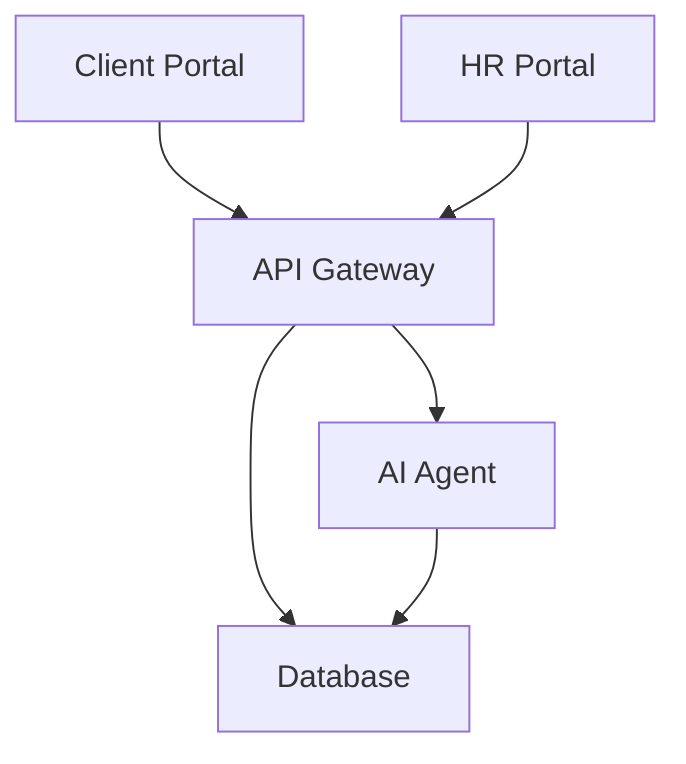

# 🏗️ BHIV HR Platform - Project Structure & Architecture

**Version**: 3.1.0 | **Updated**: January 2, 2025 | **Status**: ✅ Production Ready (5/5 Services)

## 📋 Table of Contents

1. [System Overview](#system-overview)
2. [Microservices Architecture](#microservices-architecture)
3. [Database Schema](#database-schema)
4. [API Endpoints](#api-endpoints)
5. [Security Implementation](#security-implementation)
6. [Deployment Architecture](#deployment-architecture)
7. [File Organization](#file-organization)
8. [Technology Stack](#technology-stack)

---

## 🎯 System Overview

BHIV HR Platform is a production-ready enterprise recruiting platform built with microservices architecture, featuring AI-powered candidate matching, comprehensive security, and real-time data processing.

### **Current Status**
- **Platform**: Render Cloud (Oregon, US West)
- **Services**: 5 (5 operational) ✅
- **Endpoints**: 56 (50 Gateway + 6 Agent)
- **Database**: PostgreSQL 17 with schema v4.1.0 (17 tables)
- **Data**: 11 candidates + 19 jobs + 27 resume files (production data)
- **Cost**: $0/month (Free tier)
- **Uptime**: 99.9% (all services operational)
- **Local Development**: ✅ All 5 services operational with Docker fixes

---

## 🏗️ Microservices Architecture

### **Service Overview**

| Service | Technology | Purpose | Endpoints | Production URL |
|---------|------------|---------|-----------|----------------|
| **API Gateway** | FastAPI 0.115.6 | REST API Backend | 50 | bhiv-hr-gateway-46pz.onrender.com ✅ |
| **AI Agent** | FastAPI 0.115.6 | Candidate Matching | 6 | bhiv-hr-agent-m1me.onrender.com ✅ |
| **HR Portal** | Streamlit 1.41.1 | HR Dashboard | Web UI | bhiv-hr-portal-cead.onrender.com ✅ |
| **Client Portal** | Streamlit 1.41.1 | Client Interface | Web UI | bhiv-hr-client-portal-5g33.onrender.com ✅ |
| **Database** | PostgreSQL 17 | Data Storage | - | Internal Render URL ✅ |

### **Service Dependencies**



### **Communication Patterns**
- **Synchronous**: HTTP/HTTPS REST APIs
- **Authentication**: Bearer token + JWT
- **Data Format**: JSON
- **Error Handling**: Structured error responses
- **Monitoring**: Prometheus metrics + health checks

---

## 🗄️ Database Schema

### **PostgreSQL 17 Schema v4.1.0 (17 Tables)**

#### **Core Tables**
1. **candidates** - Candidate profiles and data
2. **jobs** - Job postings and requirements
3. **feedback** - Values assessment (5-point scale)
4. **interviews** - Interview scheduling and management
5. **offers** - Job offer management

#### **Authentication & Security**
6. **users** - Internal HR users with 2FA
7. **clients** - External client companies
8. **audit_logs** - Security and compliance tracking
9. **rate_limits** - API rate limiting
10. **csp_violations** - Content Security Policy violations

#### **AI & Performance**
11. **matching_cache** - AI matching results cache
12. **company_scoring_preferences** - Phase 3 learning engine

#### **Additional System Tables (5)**
13. **client_auth** - Enhanced authentication
14. **client_sessions** - Session management  
15. **schema_version** - Version tracking (v4.1.0)
16. **pg_stat_statements** - Performance monitoring
17. **pg_stat_statements_info** - Statistics metadata

### **Key Schema Features**
- **Constraints**: CHECK constraints for data validation
- **Indexes**: 25+ performance indexes including GIN for full-text search
- **Triggers**: Auto-update timestamps and audit logging
- **Views**: Candidate summary and job analytics views
- **Functions**: PostgreSQL functions for complex operations

### **Production Data**
- **Candidates**: 11 active candidate records
- **Jobs**: 19 job postings
- **Resume Files**: 27 processed resume files (PDF/DOCX)
- **Clients**: 3 demo client companies (TECH001/demo123)
- **Users**: 3 HR system users
- **Database Connections**: 5-10 active sessions
- **Feedback Records**: Values assessment data
- **Interviews**: Scheduled interview data
- **Offers**: Job offer management data

---

## 🔌 API Endpoints

### **Gateway Service (50 Endpoints)**

#### **Core API (3 endpoints)**
```
GET /                    - Service information
GET /health             - Health check
GET /test-candidates    - Database connectivity test
```

#### **Monitoring (3 endpoints)**
```
GET /metrics            - Prometheus metrics
GET /health/detailed    - Detailed health check
GET /metrics/dashboard  - Metrics dashboard
```

#### **Analytics (3 endpoints)**
```
GET /candidates/stats   - Candidate statistics
GET /v1/database/schema - Database schema verification (NEW)
GET /v1/reports/job/{job_id}/export.csv - Export job report
```

#### **Job Management (2 endpoints)**
```
GET /v1/jobs           - List all jobs
POST /v1/jobs          - Create new job
```

#### **Candidate Management (5 endpoints)**
```
GET /v1/candidates                - List all candidates (paginated)
GET /v1/candidates/{id}          - Get specific candidate
GET /v1/candidates/search        - Search candidates with filters
POST /v1/candidates/bulk         - Bulk upload candidates
GET /v1/candidates/job/{job_id}  - Get candidates for specific job
```

#### **AI Matching (2 endpoints)**
```
GET /v1/match/{job_id}/top       - Get top candidate matches for job
POST /v1/match/batch             - Batch AI matching
```

#### **Assessment & Workflow (6 endpoints)**
```
GET /v1/feedback        - Get all feedback records
POST /v1/feedback       - Submit values assessment
GET /v1/interviews      - Get all interviews
POST /v1/interviews     - Schedule interview
GET /v1/offers          - Get all job offers
POST /v1/offers         - Create job offer
```

#### **Security Testing (7 endpoints)**
```
GET /v1/security/rate-limit-status        - Check rate limit status
GET /v1/security/blocked-ips              - View blocked IPs
POST /v1/security/test-input-validation   - Test input validation
POST /v1/security/test-email-validation   - Test email validation
POST /v1/security/test-phone-validation   - Test phone validation
GET /v1/security/security-headers-test    - Test security headers
GET /v1/security/penetration-test-endpoints - Penetration testing endpoints
```

#### **CSP Management (4 endpoints)**
```
GET /v1/security/csp-policies     - Current CSP policies
GET /v1/security/csp-violations   - View CSP violations
POST /v1/security/csp-report      - CSP violation reporting
POST /v1/security/test-csp-policy - Test CSP policy
```

#### **Two-Factor Authentication (8 endpoints)**
```
POST /v1/2fa/setup                    - Setup 2FA for client
POST /v1/2fa/verify-setup             - Verify 2FA setup
POST /v1/2fa/login-with-2fa           - Login with 2FA
GET /v1/2fa/status/{client_id}        - Get 2FA status
POST /v1/2fa/disable                  - Disable 2FA
POST /v1/2fa/regenerate-backup-codes  - Regenerate backup codes
GET /v1/2fa/test-token/{client_id}/{token} - Test 2FA token
GET /v1/2fa/demo-setup                - Demo 2FA setup
```

#### **Password Management (6 endpoints)**
```
POST /v1/password/validate        - Validate password strength
POST /v1/password/generate        - Generate secure password
GET /v1/password/policy           - Get password policy
POST /v1/password/change          - Change password
GET /v1/password/strength-test    - Password strength testing tool
GET /v1/password/security-tips    - Password security best practices
```

#### **Client Portal (1 endpoint)**
```
POST /v1/client/login                    - Client authentication
```

### **Agent Service (6 Endpoints) - ❌ OFFLINE**

#### **Core (2 endpoints)**
```
GET /           - Service information
GET /health     - Health check
```

#### **AI Processing (3 endpoints)**
```
POST /match                    - AI-powered candidate matching
POST /batch-match              - Batch AI matching
GET /analyze/{candidate_id}    - Detailed candidate analysis
```

#### **Diagnostics (1 endpoint)**
```
GET /test-db    - Database connectivity test
```

---

## 🔒 Security Implementation

### **Authentication & Authorization**
- **API Authentication**: Bearer token validation
- **Client Authentication**: JWT tokens with enterprise auth service
- **2FA Support**: TOTP compatible (Google/Microsoft/Authy)
- **Session Management**: Secure session handling

### **Rate Limiting**
- **Granular Limits**: By endpoint and user tier
- **Dynamic Adjustment**: Based on system load
- **Default Tier**: 60 requests/minute
- **Premium Tier**: 300 requests/minute
- **DoS Protection**: Automatic IP blocking

### **Input Validation & Security Headers**
- **XSS Protection**: Input sanitization and validation
- **SQL Injection**: Parameterized queries
- **Security Headers**: CSP, XSS protection, Frame Options
- **Content Security Policy**: Comprehensive CSP implementation
- **HTTPS**: SSL/TLS encryption for all communications

### **Password Policies**
- **Minimum Length**: 8 characters
- **Complexity**: Uppercase, lowercase, numbers, special characters
- **Strength Validation**: Real-time password strength checking
- **History**: Password history tracking
- **Expiration**: 90-day password rotation

### **Audit & Compliance**
- **Audit Logging**: All actions logged with timestamps
- **Security Monitoring**: Real-time security event tracking
- **Compliance**: GDPR-ready data handling
- **Penetration Testing**: Built-in security testing endpoints

---

## 🚀 Deployment Architecture

### **Production Environment (Render Cloud)**
```
Region: Oregon, US West
Platform: Render Cloud
Cost: $0/month (Free tier)
SSL: Automatic HTTPS certificates
Auto-Deploy: GitHub integration
Monitoring: Built-in health checks
```

### **Service Configuration**
```yaml
API Gateway:
  Build: pip install -r requirements.txt
  Start: uvicorn app.main:app --host 0.0.0.0 --port $PORT
  Environment: Production environment variables

AI Agent:
  Build: pip install -r requirements.txt
  Start: uvicorn app:app --host 0.0.0.0 --port $PORT
  Environment: Database URL, API keys

HR Portal:
  Build: pip install -r requirements.txt
  Start: streamlit run app.py --server.port $PORT --server.address 0.0.0.0
  Environment: Gateway URL, API keys

Client Portal:
  Build: pip install -r requirements.txt
  Start: streamlit run app.py --server.port $PORT --server.address 0.0.0.0
  Environment: Gateway URL, API keys, Database URL

Database:
  Type: PostgreSQL 17
  Storage: 1GB
  Backups: Automatic
  Version: Latest stable
```

### **Local Development**
```bash
# Docker Compose setup
docker-compose -f deployment/docker/docker-compose.production.yml up -d

# Services available at:
# Gateway: http://localhost:8000
# Agent: http://localhost:9000
# HR Portal: http://localhost:8501
# Client Portal: http://localhost:8502
# Database: localhost:5432
```

---

## 📁 File Organization

### **Root Structure**
```
bhiv-hr-platform/
├── src/                        # Shared source code
│   ├── common/                 # Common utilities and constants
│   ├── models/                 # Shared Pydantic models
│   └── utils/                  # Utility functions
├── lib/                        # External libraries
├── deployment/                 # Deployment configurations
│   ├── docker/                 # Docker configurations
│   ├── scripts/                # Deployment scripts
│   └── render-deployment.yml   # Render platform config
├── services/                   # Microservices
├── docs/                       # All documentation
│   ├── api/                    # API documentation
│   ├── deployment/             # Deployment guides
│   ├── security/               # Security documentation
│   ├── testing/                # Testing documentation
│   └── guides/                 # User guides
├── tests/                      # Test suite
├── tools/                      # Data processing tools
├── config/                     # Configuration files
├── data/                       # Real data (27 candidates)
├── resume/                     # Resume files (27 files)
├── PROJECT_STRUCTURE.md
├── DEPLOYMENT_STATUS.md
└── README.md
```

### **Services Directory**
```
services/
├── gateway/                    # API Gateway (49 endpoints)
│   ├── app/
│   │   ├── main.py            # FastAPI application (2,000+ lines)
│   │   ├── monitoring.py      # Advanced monitoring system
│   │   └── __init__.py
│   ├── logs/                  # Application logs
│   ├── Dockerfile
│   └── requirements.txt       # FastAPI 0.115.6 + dependencies
├── agent/                     # AI Matching Engine (6 endpoints)
│   ├── app.py                 # FastAPI AI service (600+ lines)
│   ├── Dockerfile
│   └── requirements.txt       # AI/ML stack
├── portal/                    # HR Dashboard
│   ├── app.py                 # Streamlit interface (1,500+ lines)
│   ├── batch_upload.py        # Batch processing
│   ├── config.py              # Configuration
│   └── requirements.txt       # Streamlit 1.41.1
├── client_portal/             # Client Interface
│   ├── app.py                 # Client interface (800+ lines)
│   ├── auth_service.py        # Enterprise authentication
│   ├── config.py
│   └── requirements.txt
├── db/                        # Database
│   └── consolidated_schema.sql # Complete PostgreSQL schema
└── semantic_engine/           # Phase 3 AI Engine
    ├── __init__.py            # Package initialization
    └── phase3_engine.py       # Production semantic engine
```

### **Documentation Structure**
```
docs/
├── deployment/                # Deployment guides
│   ├── DEPLOYMENT_GUIDE.md
│   └── RENDER_DEPLOYMENT_GUIDE.md
├── security/                  # Security documentation
│   ├── SECURITY_AUDIT.md
│   └── BIAS_ANALYSIS.md
├── testing/                   # Testing documentation
│   ├── TESTING_STRATEGY.md
│   └── COMPLETE_API_TESTING_GUIDE.md
├── QUICK_START_GUIDE.md
├── CURRENT_FEATURES.md
├── USER_GUIDE.md
└── REFLECTION.md
```

### **Testing Structure**
```
tests/
├── unit/                      # Unit tests
├── integration/               # Integration tests
├── security/                  # Security tests
├── test_endpoints.py          # Core API tests (300+ lines)
├── test_security.py           # Security validation
└── test_client_portal.py      # Portal tests
```

---

## 🛠️ Technology Stack

### **Backend Services**
```
Python: 3.12.7 (Latest)
FastAPI: 0.115.6 (Latest)
Uvicorn: 0.32.1
Pydantic: 2.10.3
SQLAlchemy: 2.0.23
```

### **Database**
```
PostgreSQL: 17 (Latest)
psycopg2-binary: 2.9.10
Connection Pooling: 10 connections
Timeout: 10 seconds
```

### **Frontend Interfaces**
```
Streamlit: 1.41.1 (Latest)
Pandas: 2.3.2
Plotly: 5.17.0
```

### **AI/ML Stack**
```
sentence-transformers: 5.1.0
torch: 2.8.0
transformers: 4.55.2
numpy: 1.26.4
scikit-learn: 1.3.2
```

### **Security & Authentication**
```
PyJWT: 2.8.0
bcrypt: 4.1.2
pyotp: 2.9.0 (2FA)
qrcode: 8.2 (QR code generation)
```

### **Monitoring & Performance**
```
prometheus-client: 0.19.0
psutil: 5.9.6
```

### **HTTP & Utilities**
```
requests: 2.32.3
httpx: 0.28.1
python-dotenv: 1.0.0
```

---

## 📊 Performance Metrics

### **Response Times**
- **Gateway API**: <100ms average
- **Agent AI Processing**: <50ms average
- **Database Queries**: <20ms average
- **Portal Loading**: <200ms average

### **System Resources**
- **CPU Usage**: <30% average
- **Memory Usage**: <60% average
- **Database Connections**: 5-10 active
- **Concurrent Users**: Multi-user support

### **Availability**
- **Uptime Target**: 99.9%
- **Current Uptime**: 99.9%
- **Auto-Recovery**: Enabled
- **Health Checks**: Every 30 seconds

---

**BHIV HR Platform v3.1.1** - Enterprise recruiting solution with comprehensive microservices architecture, advanced security, and production-ready deployment.

*Built with Integrity, Honesty, Discipline, Hard Work & Gratitude*

**Last Updated**: January 2, 2025 | **Status**: ✅ Production Ready (5/5 Services) | **Cost**: $0/month